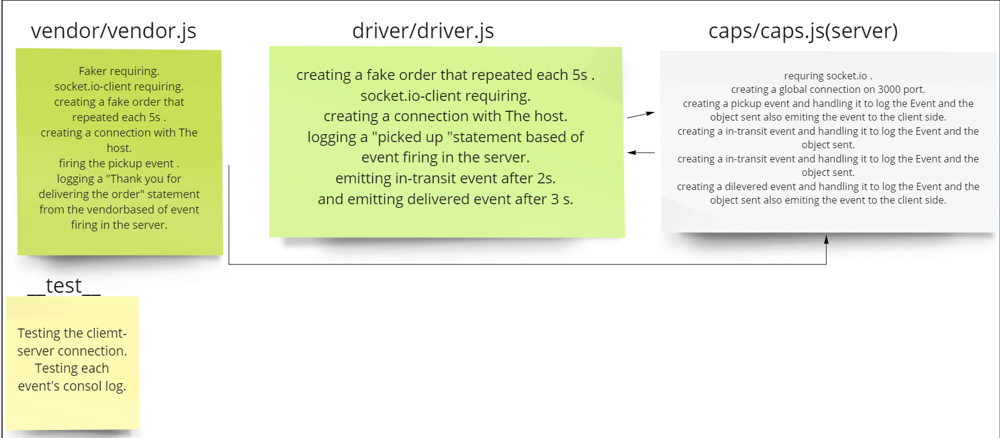
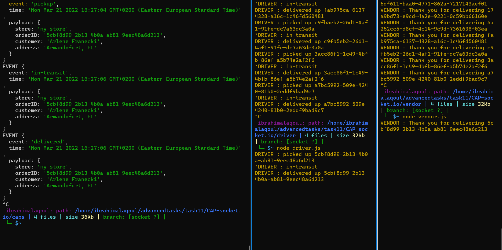

# CAP-socket.io
## socket.io server-client events handleng.

# Lab Summary:
### For today's lab what i've done so far :
*  I created three different Apps.
* The first one is caps (server) which will open a global connection to the other clients.
* the second is driver(client) the third one is Vendor(client).

* created three events the first one is pickup event it will be emited with an order from the vendor client and then the server will create an action on this event to log the "EVENT" and the object data from the emitting side  and then emit this event to the driver client which will create an action also based on this event and emit in-transit and dilevered events from the driver client.

*  The second one is in-transit event it will be emited  with an order from the driver client and then the server will create an action on this event to log the "EVENT  and the data from the emitting side.

* The third one is dilevered event it will be emited with an order from the driver client and then the server will create an action on this event to log the "EVENT" and the object data from the emitting side  and then emit this event to the vendor client which will create an action also based on this event .

# UML :

# Terminal Output:

# Links:
* [PR link](https://github.com/ibrahimalaqoul/CAP-socket.io/pull/11);

* [Actions link](https://github.com/ibrahimalaqoul/CAP-socket.io/actions)
